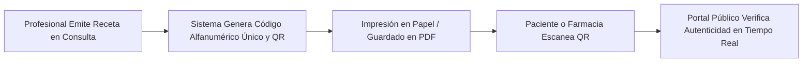

# 📖 Manual de Usuario — Clínica Personal
### Sistema de Gestión Clínica Integral y Multi-Especialidad (Dermatología & Psicología)

---

## 📑 Tabla de Contenidos

1. [Introducción y Visión General](#1-introducción-y-visión-general)
2. [Arquitectura de Seguridad y Roles de Usuario](#2-arquitectura-de-seguridad-y-roles-de-usuario)
3. [Acceso al Sistema y Gestión de Cuenta](#3-acceso-al-sistema-y-gestión-de-cuenta)
4. [Entorno de Trabajo y Navegación Rápida](#4-entorno-de-trabajo-y-navegación-rápida)
5. [Panel de Control (Dashboard)](#5-panel-de-control-dashboard)
6. [Gestión Integral de Pacientes](#6-gestión-integral-de-pacientes)
7. [Expediente e Historia Clínica — Módulo General](#7-expediente-e-historia-clínica--módulo-general)
8. [Historia Clínica Especializada — Rama Psicología](#8-historia-clínica-especializada--rama-psicología)
9. [Historia Clínica Especializada — Rama Dermatología](#9-historia-clínica-especializada--rama-dermatología)
10. [Recetas Médicas y Verificación Pública con QR](#10-recetas-médicas-y-verificación-pública-con-qr)
11. [Gestión Documental Clínica y Archivos Adjuntos](#11-gestión-documental-clínica-y-archivos-adjuntos)
12. [Impresión y Exportación de la Historia Clínica](#12-impresión-y-exportación-de-la-historia-clínica)
13. [Agenda Médica y Gestión de Citas](#13-agenda-médica-y-gestión-de-citas)
14. [Cobros, Caja y Facturación](#14-cobros-caja-y-facturación)
15. [Catálogo de Servicios Clínicos](#15-catálogo-de-servicios-clínicos)
16. [Control de Inventario y Suministros Médicos](#16-control-de-inventario-y-suministros-médicos)
17. [Administración del Sistema: Personal, Cuentas y Catálogos](#17-administración-del-sistema-personal-cuentas-y-catálogos)
18. [Editor Visual de la Página Web (Landing Page)](#18-editor-visual-de-la-página-web-landing-page)
19. [Portal Público y Verificación de Documentos](#19-portal-público-y-verificación-de-documentos)
20. [Guía de Solución de Problemas y Preguntas Frecuentes (FAQ)](#20-guía-de-solución-de-problemas-y-preguntas-frecuentes-faq)

---

## 1. Introducción y Visión General

**Clínica Personal** es una plataforma clínica moderna diseñada para optimizar los procesos de atención médica, gestión de pacientes, control financiero, administración de inventarios y presencia web institucional.

El sistema cuenta con un motor **Multi-Especialidad Nativo** que adapta la experiencia del usuario según la rama clínica activa:
- **Módulo de Psicología**: Orientado a la evaluación de la salud mental, notas de evolución bajo metodología **SOAP** (Subjetivo, Objetivo, Análisis, Plan), planes psicoterapéuticos con metas e intervenciones, diagnósticos y aplicación de **pruebas psicométricas** con cálculo automatizado de percentiles e interpretaciones baremadas.
- **Módulo de Dermatología**: Especializado en el cuidado de la piel, registro de fototipo **Fitzpatrick**, hábitos solares, registro y **mapeo fotográfico de lesiones cutáneas**, diagnósticos dermatológicos, exámenes auxiliares (biopsias, cultivos), procedimientos clínicos y seguimiento de tratamientos farmacológicos y tópicos.

### Principios Fundamentales del Sistema
- **Privacidad y Aislamiento Clínico**: Cada profesional visualiza y gestiona la información clínica correspondiente a su especialidad asignada, garantizando confidencialidad médica según la política de autorización *owner-or-admin*.
- **Trazabilidad y Auditoría**: El sistema utiliza borrado lógico (*soft-delete*) en registros médicos, preservando la autoría (`professional_id`), fechas de creación y actualización para cumplimiento médico-legal.
- **Flujo de Atención Ágil**: Conexión directa entre Cita ➔ Atención Clínica / Consulta ➔ Receta Médica con QR ➔ Registro de Cobro.

---

## 2. Arquitectura de Seguridad y Roles de Usuario

El acceso a las funcionalidades y datos clínicos está estrictamente controlado mediante roles y la especialidad asignada al usuario en su token de sesión.

| Rol | Especialidad | Alcance y Permisos |
| :--- | :--- | :--- |
| **`ROLE_USER`** *(Profesional Clínico)* | `PSICOLOGIA` o `DERMATOLOGIA` | • Registro y consulta de pacientes.<br>• Creación y edición de sus propias consultas, evaluaciones, notas clínicas, recetas y planes terapéuticos.<br>• Gestión de su Agenda de citas.<br>• Consulta de catálogo de servicios y visualización de inventario.<br>• Registro de cobros y pagos de pacientes. |
| **`ROLE_ADMIN`** *(Director / Administrador Clínico)* | `PSICOLOGIA` o `DERMATOLOGIA` | • Todos los permisos de `ROLE_USER` en su especialidad.<br>• Supervisión y edición de registros clínicos de otros profesionales de su misma especialidad.<br>• Gestión de Personal y Cuentas de Usuario (crear usuarios, habilitar/deshabilitar, reset de contraseñas).<br>• Administración del Catálogo de Servicios (tarifas y precios).<br>• Gestión de Catálogos dinámicos del sistema.<br>• Ajustes de inventario médico.<br>• Acceso al Editor del Sitio Web. |
| **`ROLE_SITE_ADMIN`** *(Administrador Web / Marketing)* | Transversal | • Acceso exclusivo al Editor Visual de la Landing Page pública (`/editar-sitio`).<br>• Configuración de contenidos, testimonios, profesionales y apariencia del portal web.<br>• **Sin acceso** a historias clínicas ni datos sensibles de pacientes (privacidad médica estricta). |

---

## 3. Acceso al Sistema y Gestión de Cuenta

### 3.1 Inicio de Sesión (Login)
1. Abra el navegador e ingrese a la dirección del sistema (por ejemplo, `http://localhost:4200/login`).
2. Introduzca su **Nombre de Usuario** y su **Contraseña**.
3. Haga clic en **"Iniciar Sesión"**.
4. El sistema autenticará sus credenciales, emitirá un token de acceso seguro y cargará automáticamente el entorno correspondiente a su especialidad y rol.

> [!NOTE]
> Por motivos de seguridad, el sistema cuenta con un servicio de protección contra ataques de fuerza bruta que bloquea temporalmente el acceso tras reiterados intentos fallidos.

### 3.2 Cerrar Sesión
Para finalizar su sesión de forma segura:
1. En la parte inferior de la barra lateral izquierda, localice el botón **"Cerrar sesión"** (ícono de puerta de salida).
2. Haga clic en el botón. El sistema invalidará el token en el servidor, eliminará las credenciales seguras del navegador y lo redirigirá a la pantalla de login.

### 3.3 Gestión de Perfil y Cambio de Contraseña
1. Haga clic en su avatar o nombre ubicado en la esquina superior derecha o al final del menú lateral (**"Mi Perfil"**).
2. En la pantalla de perfil podrá consultar:
   - Nombre de usuario, nombre completo y correo electrónico.
   - Rol asignado y especialidad médica activa.
3. Para modificar su clave de acceso:
   - Complete el campo **"Contraseña actual"**.
   - Ingrese la **"Nueva contraseña"** y confírmela.
   - Haga clic en **"Guardar cambios"**.

---

## 4. Entorno de Trabajo y Navegación Rápida

La interfaz de Clínica Personal está diseñada para maximizar la productividad clínica mediante un diseño limpio, accesible y responsivo.

### 4.1 Barra Lateral de Navegación (Sidebar)
- **Logotipo y Nombre de la Clínica**: Identificador de la institución.
- **Insignia de Especialidad Activa**:
  - 🟣 **Púrpura**: Módulo Activo de **Psicología**.
  - 🔵 **Cian**: Módulo Activo de **Dermatología**.
- **Menú Agrupado**:
  - **Principal**: Dashboard, Agenda, Pacientes, Cobros.
  - **Operación & Recursos**: Servicios, Pruebas (Psicología), Inventario, Catálogos, Personal & Cuentas (Admin).
  - **Sitio Web**: Acceso directo al Editor del Sitio Web (Admin/Site Admin).
- **Botón de Colapso**: Permite compactar la barra lateral a modo solo íconos para ganar mayor área de trabajo en pantallas medianas y grandes.

### 4.2 Paleta de Comandos Global — Omnibox (`Ctrl + K`)
Presione la combinación de teclas <kbd>Ctrl</kbd> + <kbd>K</kbd> (o haga clic en la barra superior *"Buscar o comando..."*):
- **Búsqueda Instantánea de Pacientes**: Escriba el nombre, apellido, número de documento o teléfono para abrir directamente su ficha.
- **Acceso Rápido a Secciones**: Escriba "Agenda", "Cobros", "Inventario", "Servicios" o "Perfil" para navegar sin usar el ratón.
- **Acciones Directas**: Iniciar nuevo paciente o agendar citas con un solo clic.

---

## 5. Panel de Control (Dashboard)

El Dashboard ofrece una vista panorámica del estado de la clínica y las prioridades del día, adaptada a la especialidad del usuario:

### 5.1 Indicadores Clave de Rendimiento (KPIs)
- **Pacientes Atendidos**: Total de pacientes activos y consultas registradas en el período.
- **Citas Programadas para Hoy**: Conteo de atenciones agendadas para la jornada.
- **Métricas Especializadas**:
  - *Psicología*: Pruebas psicométricas aplicadas y sesiones de terapia en curso.
  - *Dermatología*: Evaluaciones dermatológicas del mes y procedimientos realizados.
- **Balance Financiero**: Resumen de ingresos generados y cobros pendientes del mes.

### 5.2 Alertas de Riesgo Clínico Destacadas
Sección visual prioritaria con alertas activas de pacientes que requieren atención inmediata (por ejemplo: ideación suicida, crisis de angustia severa, sospecha de melanoma o alergias graves a fármacos). Cada alerta permite acceder directamente a la ficha del paciente.

### 5.3 Agenda del Día y Pacientes Recientes
- Lista cronológica de las citas programadas para el día de hoy, con indicador de estado (Programada, Confirmada, En Consulta).
- Accesos directos para iniciar la consulta o marcar asistencia con un solo clic.

---

## 6. Gestión Integral de Pacientes

El módulo de pacientes centraliza la información demográfica, de contacto y el acceso al expediente clínico completo.

### 6.1 Listado y Búsqueda de Pacientes (`/patients`)
- **Buscador en Tiempo Real**: Filtrado dinámico por nombre, apellidos, número de documento (DNI/Pasaporte/Cédula) o teléfono.
- **Filtros Avanzados**: Filtrado por género, rango de edad y estado.
- **Acciones Rápidas en Tabla / Tarjetas**:
  - 👁️ **Ver Ficha**: Abre la Historia Clínica 360° del paciente.
  - ✏️ **Editar**: Modifica los datos demográficos y de contacto.
  - 📅 **Agendar Cita**: Abre el modal de programación con el paciente preseleccionado.
  - 🗑️ **Eliminar (Soft-delete)**: Inactiva el registro conservando el historial legal.

### 6.2 Registro de Nuevo Paciente (`/patients/new`)
1. Haga clic en el botón superior **"Nuevo Paciente"**.
2. Complete el formulario estructurado:
   - **Datos Personales**: Nombres, Apellidos, Tipo y Número de Documento (único en el sistema), Género (Masculino, Femenino, Otro), Fecha de Nacimiento (el sistema calcula automáticamente la edad actual).
   - **Información de Contacto**: Teléfono móvil, Correo electrónico, Dirección residencial y Ciudad.
   - **Contacto de Emergencia**: Nombre de la persona de contacto, relación/parentesco y teléfono de urgencia.
   - **Notas Administrativas**: Observaciones generales de recepción o derivación.
3. Haga clic en **"Guardar Paciente"**. Se generará la ficha única del paciente y su identificador clínico.

---

## 7. Expediente e Historia Clínica — Módulo General

Al ingresar a la ficha de un paciente (`/patients/:id`), el profesional dispone de una vista tipo **Shell Clínico** con una barra lateral interna que organiza toda la información médica en secciones jerárquicas con contadores dinámicos.

### 7.1 Banner de Alertas de Riesgo Clínico
Ubicado en la parte superior del expediente. Permite advertir rápidamente situaciones críticas del paciente.
- **Crear Alerta de Riesgo**:
  1. Haga clic en **"+ Nueva Alerta"**.
  2. Seleccione el **Nivel de Severidad**:
     - 🔴 **ALTO / CRÍTICO**: Alertas vitales (rojo).
     - 🟡 **MEDIO**: Advertencias clínicas relevantes (amarillo).
     - 🔵 **BAJO / INFORMATIVO**: Notas de precaución (azul).
  3. Indique el motivo o descripción detallada (ej. *Alergia severa a Penicilina*, *Riesgo de fuga*, *Lesión atípica con sangrado*).
  4. Guardar.
- **Resolver Alerta**: Cuando la situación esté controlada, haga clic en "Resolver" para archivarse con fecha y profesional responsable.

### 7.2 Antecedentes Generales
Formulario permanente tipo documento único (1 por paciente):
- **Antecedentes Patológicos**: Enfermedades previas o crónicas (Diabetes, Hipertensión, Asma, etc.).
- **Antecedentes Quirúrgicos**: Cirugías previas, hospitalizaciones, transfusiones.
- **Antecedentes Familiares**: Historial médico hereditario de relevancia.
- **Hábitos y Estilo de Vida**: Consumo de tabaco, alcohol, actividad física, patrones de sueño, alimentación.

### 7.3 Alergias
Listado detallado de reacciones adversas conocidas:
- **Campos**: Alérgeno (ej. Penicilina, Mariscos, Látex), Tipo (Medicamento, Alimento, Contacto, Ambiental), Severidad (Leve, Moderada, Grave), Reacción descrita (ej. Anafilaxia, Urticaria) y Estado (Activa / Inactiva).
- Cada registro muestra un distintivo visual según la severidad.

### 7.4 Medicamentos de Uso Continuo
Registro de fármacos que el paciente toma actualmente de forma regular:
- **Campos**: Nombre comercial o genérico del medicamento, Dosis (ej. 50 mg), Frecuencia (ej. Cada 12 horas), Vía de administración, Fecha de inicio y Fecha estimada de término o indicación permanente.

---

## 8. Historia Clínica Especializada — Rama Psicología

> [!NOTE]
> Estas secciones son visibles y operativas exclusivamente para profesionales con especialidad **`PSICOLOGIA`**.

### 8.1 Evaluación Psicológica Inicial
Documento integral de evaluación estructurado en tres bloques:
1. **Motivo de Consulta y Evaluación Inicial**: Demanda inicial del paciente o remitente, descripción cronológica del problema actual y sintomatología reportada.
2. **Antecedentes Psicológicos y Familiares**: Historia evolutiva, dinámica familiar, eventos traumáticos, duelos, tratamientos psiquiátricos o psicológicos previos.
3. **Examen de las Funciones Mentales**: Evaluación del estado de conciencia, orientación témporo-espacial, atención, memoria, pensamiento, afecto, juicio e introspección.

### 8.2 Catálogo y Aplicación de Pruebas Psicométricas (`/tests-catalog` y Ficha)
El sistema incluye un módulo automatizado para administrar e interpretar reactivos psicométricos (por ejemplo, Inventario de Depresión de Beck - BDI-II):
- **Aplicar Test a un Paciente**:
  1. Dentro de la sección *"Pruebas Psicométricas"* de la ficha, pulse **"Aplicar Nueva Prueba"**.
  2. Seleccione el instrumento del catálogo.
  3. Ingrese las respuestas a cada ítem o la puntuación directa obtenida.
  4. El sistema calculará automáticamente la **Puntuación Directa**, el **Percentil** y la **Categoría Diagnóstica** según los baremos configurados (ej. *Depresión Mínima, Leve, Moderada, Severa*).
  5. Ingrese las conclusiones clínicas cualitativas y guarde el informe.

### 8.3 Diagnósticos Psicológicos
- Registro de diagnósticos con codificación internacional (CIE-10 / DSM-5) o descriptivos.
- Clasificación por estado: **Activo**, **En Remisión** o **Resuelto**.
- Fecha de diagnóstico y notas explicativas de soporte.

### 8.4 Plan Terapéutico
- **Objetivos Terapéuticos**: Metas formuladas en conjunto con el paciente (específicas, medibles y temporales).
- **Técnicas e Intervenciones**: Modelo terapéutico (Cognitivo-Conductual, Sistémico, Humanista), tareas intersesión y estrategias psicoterapéuticas.
- **Cronograma y Estado**: Fecha de inicio, frecuencia estimada de sesiones y estado del plan (En curso, Cumplido, Suspendido).

### 8.5 Sesiones Clínicas / Consultas Psicológicas (SOAP)
Registro cronológico de cada encuentro psicoterapéutico en formato estándar:
- **S (Subjetivo)**: Lo que el paciente refiere, estado de ánimo reportado, acontecimientos de la semana.
- **O (Objetivo)**: Observaciones clínicas del terapeuta, lenguaje no verbal, actitud, reactividad emocional.
- **A (Análisis / Evaluación)**: Interpretación clínica de la evolución, adherencia a tareas, avances respecto a los objetivos.
- **P (Plan)**: Intervención para la siguiente sesión, acuerdos y tareas asignadas.
- **Opción de Confidencialidad**: Permite marcar la nota como confidencial para restringir su lectura al profesional tratante y administradores.

---

## 9. Historia Clínica Especializada — Rama Dermatología

> [!NOTE]
> Estas secciones son visibles y operativas exclusivamente para profesionales con especialidad **`DERMATOLOGIA`**.

### 9.1 Antecedentes Dermatológicos
Ficha basal dermatológica del paciente:
- **Fototipo Cutáneo Fitzpatrick**: Escala I al VI (desde piel muy clara que siempre se quema, hasta piel negra).
- **Hábitos de Exposición Solar**: Frecuencia de exposición, uso de protector solar (FPS, reaplicación), uso de cámaras de bronceado.
- **Antecedentes Cutáneos Personales y Familiares**: Psoriasis, dermatitis atópica, alopecia, antecedentes de carcinoma o melanoma.
- **Condiciones Crónicas de la Piel**: Rosácea, acné, vitíligo, melasma.

### 9.2 Mapeo y Registro de Lesiones con Fotografías Clínicas
Permite un seguimiento minucioso y gráfico de cada lesión o lunar del paciente:
1. **Registrar Nueva Lesión**:
   - Ingrese la **Zona Anatómica** (Rostro, Espalda, Tórax, Miembro superior derecho, etc.).
   - Seleccione el **Tipo de Lesión** (Mácula, Pápula, Nódulo, Placa, Vesícula, Quiste, etc.).
   - Especifique **Morfología, Color y Tamaño** en milímetros (ej. *7x5 mm, bordes irregulares, pigmentación heterogénea marrón-negro*).
   - Indique la fecha de aparición y patrón de evolución (estable, crecimiento rápido, prurito, sangrado).
2. **Subida de Fotografías Clínicas**:
   - En la tarjeta de la lesión, pulse **"Subir Fotografía"**.
   - Seleccione la imagen médica desde su equipo (formatos permitidos: `.jpg`, `.jpeg`, `.png`, `.webp`; tamaño máximo 2MB).
   - Ingrese una descripción de la toma (ej. *Dermatoscopía de lesión sospechosa interlineal*).
   - Visualice la imagen en alta resolución mediante el visor integrado (lightbox) para comparar la evolución temporal de la lesión.

### 9.3 Diagnósticos Dermatológicos
- Registro de juicio clínico presuntivo o definitivo (ej. *Carcinoma Basocelular Nodular, Acné Vulgar Grado II, Dermatitis Seborreica*).
- Fecha de confirmación y estado de la patología.

### 9.4 Exámenes Auxiliares Dermatológicos
- Registro de estudios complementarios: Biopsias por sacabocados (punch), biopsias por afeitado (shave), estudios histopatológicos, cultivos micológicos, exámenes con luz de Wood o analíticas de laboratorio.
- Registro del tipo de examen, descripción de la muestra, fecha de toma, resultado del informe patológico y fecha de entrega.

### 9.5 Tratamientos Dermatológicos
- Pautas farmacológicas tópicas (retinoides, corticoides, antibióticos locales, protectores solares terapéuticos) y sistémicas (isotretinoína, antihistamínicos, antibióticos orales).
- Registro de principio activo, dosis, vía de administración, frecuencia horaria, duración prevista y monitoreo de efectos secundarios.

### 9.6 Procedimientos Clínicos Realizados
- Registro de actos médicos menores realizados en consultorio: Crioterapia con nitrógeno líquido, electrofulguración, curetaje, infiltración intralesional, drenaje de quistes, extirpación de nevos, peelings químicos.
- Registro de fecha del procedimiento, técnica utilizada, anestesia administrada, instrumental utilizado y recomendaciones post-procedimiento.

### 9.7 Controles y Evolución Dermatológica
- Línea de tiempo cronológica de visitas de seguimiento.
- Comparativa de respuesta terapéutica, porcentaje de mejoría, tolerancia a fármacos y programación de la fecha del próximo control preventivo.

---

## 10. Recetas Médicas y Verificación Pública con QR

El sistema cuenta con un motor integral para la emisión de prescripciones médicas oficiales, trazables y verificables digitalmente.



### 10.1 Emisión de una Receta Médica
1. En la ficha del paciente, diríjase a la sección **"Recetas"** (o pulse *Emitir Receta* durante la consulta clínica).
2. Haga clic en **"+ Nueva Receta"**.
3. Ingrese los datos de la prescripción:
   - **Diagnóstico Asociado**: Indicación principal de la receta.
   - **Vigencia**: Días de validez de la receta médica (por defecto 30 días).
   - **Indicaciones Generales**: Recomendaciones no farmacológicas (hidratación, reposo, cuidados de higiene).
4. **Agregar Medicamentos / Fármacos**:
   - Pulse **"+ Agregar Medicamento"**.
   - Complete: Nombre del medicamento/presentación, Dosis (ej. *500 mg*), Vía (Oral, Tópica, Oftálmica, etc.), Frecuencia (ej. *Cada 8 horas con las comidas*), Duración del tratamiento (ej. *7 días*) e Instrucciones adicionales.
   - Puede añadir múltiples ítems a la misma receta.
5. Pulse **"Guardar Receta"**.

### 10.2 Impresión y Código QR
Al guardar la receta, el sistema genera automáticamente un **Código de Verificación Único** (ej. `RX-A9F3-8B21`) y un **Código QR dinámico**.
- Al pulsar **"Imprimir Receta"**, se genera un formato limpio con el membrete institucional de la clínica, los datos del paciente, el detalle exacto de las indicaciones, la firma y matrícula del profesional y el QR de validación en la esquina inferior.

---

## 11. Gestión Documental Clínica y Archivos Adjuntos

Permite almacenar y consultar cualquier documento digital complementario en el expediente del paciente de forma segura.

### 11.1 Subida de Documentos (`documents-section`)
1. En la ficha del paciente, seleccione la pestaña **"Documentos"**.
2. Haga clic en **"Subir Documento"**.
3. Seleccione el archivo desde su ordenador:
   - **Formatos admitidos**: PDF (`.pdf`), Imágenes (`.png`, `.jpg`, `.jpeg`, `.webp`).
   - **Tamaño máximo**: 5 MB por archivo.
4. Elija la **Categoría del Documento**:
   - *Consentimiento Informado Firmado*
   - *Informe / Resultado de Laboratorio*
   - *Informe Histopatológico / Biopsia Externa*
   - *Interconsulta / Derivación Médica*
   - *Documento de Identidad / Seguro*
   - *Otro Adjunto Clínico*
5. Ingrese un nombre descriptivo y notas opcionales.
6. Haga clic en **"Subir Archivo"**.

### 11.2 Visualización, Descarga y Borrado
- **Vista Previa Integrada**: Los archivos PDF e imágenes pueden visualizarse directamente en el navegador sin necesidad de descargarlos.
- **Descarga Segura**: Descargue el archivo original con un clic en el ícono de descarga.
- **Eliminación con Auditoría**: Si un documento fue subido por error, el profesional creador o administrador puede eliminarlo lógicamente.

---

## 12. Impresión y Exportación de la Historia Clínica

La plataforma permite generar un reporte impreso o digital en formato PDF de la historia clínica integral del paciente con diseño profesional.

### 12.1 Procedimiento de Impresión
1. En la cabecera de la ficha del paciente, haga clic en el botón **"Imprimir Historia Clínica"** (o ícono de impresora).
2. Se abrirá la vista optimizada de impresión (`clinical-history-print`):
   - **Membrete Oficial**: Incluye el logo de la clínica, razón social, dirección, teléfono y correo configurados en la institución.
   - **Ficha de Identificación del Paciente**: Nombre completo, documento, edad, fecha de nacimiento y contacto de emergencia.
   - **Cuerpo del Informe**: Antecedentes generales, alergias, medicación habitual, diagnósticos, registro de sesiones/consultas con detalle cronológico, tratamientos y procedimientos realizados.
   - **Pie de Página y Validación**: Espacio para firma médica, número de colegiatura y fecha de expedición.
3. Presione el botón **"Imprimir / Guardar como PDF"** (o <kbd>Ctrl</kbd> + <kbd>P</kbd>) en su navegador para imprimir directamente o exportar el archivo PDF.

---

## 13. Agenda Médica y Gestión de Citas

El módulo de Agenda (`/agenda`) coordina los turnos, citas y horarios de atención de la clínica.

### 13.1 Visualización del Calendario
- **Vistas Disponibles**: Vista Mensual, Vista Semanal y Vista Lista / Día.
- **Filtros**: Permite filtrar citas por estado, profesional y servicio clínico.
- **Código de Colores por Estado**:
  - 🔵 **Programada**: Cita reservada pendiente de confirmación.
  - 🟢 **Confirmada**: Paciente ha confirmado su asistencia.
  - 🟣 **En Consulta**: El paciente se encuentra actualmente en atención con el profesional.
  - ⚫ **Completada**: Atención finalizada con éxito.
  - 🔴 **Cancelada**: Cita anulada por el paciente o la clínica.
  - 🟠 **No Asistió**: El paciente no se presentó al turno programado.

### 13.2 Agendamiento de una Cita
1. Haga clic en **"Nueva Cita"** o directamente sobre el bloque horario deseado en el calendario.
2. Complete los campos del formulario:
   - **Paciente**: Escriba el nombre o documento en el autocompletado para seleccionarlo (o use el botón rápido para registrar un paciente nuevo si asiste por primera vez).
   - **Servicio Clínico**: Seleccione la prestación médica (la duración estimada en minutos se autocalcula).
   - **Fecha y Hora de Inicio**: Horario de la atención.
   - **Tipo de Cita**: Presencial o Teleconsulta / Online.
   - **Notas / Motivo de la Cita**: Breve descripción del motivo de atención.
3. Guardar Cita.

### 13.3 Flujo Rápido "Iniciar Consulta"
Al hacer clic sobre una cita en estado *Confirmada* o *Programada*, el profesional puede pulsar **"Iniciar Atención"**. Esto cambiará automáticamente el estado de la cita a *En Consulta* y abrirá directamente la pantalla de consulta clínica del paciente, precargando el motivo y la información relevante.

### 13.4 Recordatorios Automáticos de Cita por Correo Electrónico
El sistema envía de forma automatizada un correo de recordatorio a los pacientes con citas próximas, sin intervención manual del personal:
- **Programación**: Un proceso interno se ejecuta diariamente (por defecto a las 9:30 a.m.) y revisa las citas pendientes del día siguiente (el número de días de anticipación es configurable por la clínica).
- **Condiciones de envío**: Solo se envía si el servicio de correo (SMTP) está configurado en el servidor y si el paciente cuenta con una dirección de correo electrónico registrada en su ficha.
- **Contenido del correo**: Incluye el nombre de la clínica, el nombre del paciente, la fecha y hora de la cita, y un **botón de confirmación** que enlaza al portal público para que el paciente confirme su asistencia con un clic.
- **Trazabilidad**: Cada cita registra la fecha y hora en que se envió su recordatorio, evitando el envío duplicado.

> [!NOTE]
> Si la clínica no tiene configurado un servidor de correo (SMTP), esta función queda inactiva automáticamente y no genera errores en el resto del sistema.

### 13.5 Sincronización con Google Calendar
Como apoyo adicional para la organización del profesional, la Agenda puede sincronizarse automáticamente con una cuenta de **Google Calendar** de la clínica:
- Al crear, reprogramar o cancelar una cita, el sistema crea, actualiza o elimina automáticamente el evento correspondiente en el calendario de Google configurado.
- El evento incluye el nombre del paciente, teléfono y correo (si están disponibles), la especialidad, el servicio clínico, la modalidad (presencial o virtual) y, en caso de teleconsulta, el enlace de videollamada como ubicación del evento.
- Esta integración es opcional y debe ser habilitada y configurada por el administrador del sistema (credenciales de Google, calendario de destino y zona horaria). Si no está habilitada, la Agenda funciona con total normalidad sin sincronizar eventos externos.

---

## 14. Cobros, Caja y Facturación

El módulo de Cobros (`/billing`) gestiona el registro de ingresos económicos, emisión de recibos y trazabilidad de pagos de consultas y procedimientos.

### 14.1 Registrar un Pago / Cobro
1. Desde el menú lateral ingrese a **"Cobros"** y haga clic en **"Nuevo Cobro"** (o desde la ficha del paciente en la pestaña *Cobros*).
2. Seleccione al **Paciente**.
3. **Agregar Conceptos a Cobrar**:
   - Seleccione los servicios clínicos realizados (ej. *Consulta Dermatológica de Primera Vez*, *Sesión de Psicoterapia Individual*, *Procedimiento de Crioterapia*).
   - Ingrese la cantidad y confirme el precio unitario (el sistema calcula automáticamente el subtotal).
   - Aplique descuentos o recargos si corresponde.
4. **Seleccionar Método de Pago**:
   - 💵 **Efectivo (`CASH`)**
   - 💳 **Tarjeta de Débito / Crédito (`CARD`)**
   - 🏦 **Transferencia Bancaria (`TRANSFER`)**
   - 📱 **Billetera Digital (`YAPE_PLIN`)**
5. Indique el número de operación o referencia bancaria y notas de caja.
6. Haga clic en **"Procesar Cobro"**.

### 14.2 Detalle de Pago y Comprobante de Recibo
Cada cobro registrado genera un comprobante digital con número de recibo correlativo, desglose de ítems, fecha, método de pago e identificación del cajero/profesional que registró la transacción, listo para imprimir o enviar al paciente.

### 14.3 Resumen Financiero y Reportes de Caja
La sección de Cobros incluye un panel de reporte financiero con indicadores y gráficos, filtrable por período (Hoy, Últimos 7 días, Este mes, Mes anterior, Año o un rango de fechas personalizado, hasta un máximo de 366 días):
- **Ingresos del Día y del Período**: Total efectivamente cobrado, con el número de pagos registrados y el ticket promedio por cobro.
- **Variación respecto al Período Anterior**: Porcentaje de crecimiento o caída de ingresos comparado con el mes o rango anterior equivalente.
- **Saldo Pendiente**: Diferencia entre el total facturado/cargado y el total efectivamente recibido de los pacientes.
- **Gráfico de Ingresos Diarios**: Línea de tendencia de los ingresos día a día dentro del período seleccionado.
- **Desglose por Método de Pago**: Gráfico circular con el monto y número de transacciones por cada método (Efectivo, Tarjeta, Transferencia, Yape/Plin).
- **Top de Servicios más Facturados**: Ranking de los cinco servicios clínicos que más ingresos generaron en el período.
- **Saldo por Paciente**: Consultando la ficha de un paciente específico, el sistema calcula su saldo individual (total cargado menos total pagado), útil para identificar pacientes con cuentas pendientes.

> [!NOTE]
> Los reportes financieros están segmentados por especialidad: un profesional de Psicología solo visualiza los ingresos y estadísticas correspondientes a su rama, y lo mismo aplica para Dermatología.

---

## 15. Catálogo de Servicios Clínicos

Disponible en `/services`. Permite definir el tarifario y la cartera de prestaciones de la clínica por especialidad.

> [!IMPORTANT]
> La creación, modificación de precios y eliminación de servicios clínicos está reservada exclusivamente a usuarios con rol **`ROLE_ADMIN`**. Los usuarios con `ROLE_USER` pueden consultar el catálogo para agendamiento y cobros.

### 15.1 Crear o Editar un Servicio Clínico
1. En la lista de servicios, pulse **"Nuevo Servicio"**.
2. Complete la información:
   - **Nombre del Servicio**: (ej. *Terapia de Pareja*, *Dermatoscopía Digital de Lunares*).
   - **Categoría**: Clasificación interna (Consulta, Procedimiento, Terapia, Control).
   - **Precio Base**: Tarifa en la moneda local.
   - **Duración Estimada**: Tiempo estándar de atención en minutos (ej. 30, 45, 60 min) que utilizará la Agenda para bloquear el horario.
   - **Descripción**: Resumen del servicio para orientación del paciente y recepción.
   - **Estado**: Activo / Inactivo.
3. Guardar.

---

## 16. Control de Inventario y Suministros Médicos

El módulo de Inventario (`/inventory`) gestiona el stock de medicamentos, materiales descartables, reactivos y suministros médicos de la clínica.

### 16.1 Catálogo de Insumos
- **Ficha del Insumo**: Código de referencia, nombre comercial/genérico, categoría (Descartables, Farmacia, Instrumental, Dermocosmética, Oficina), unidad de medida (Caja, Frasco, Unidad, Ampolla).
- **Semáforo de Stock**:
  - 🟢 **Stock Óptimo**: Cantidad actual superior al nivel de seguridad.
  - 🟡 **Stock Bajo**: Cantidad cercana o igual al stock mínimo configurado.
  - 🔴 **Stock Crítico / Agotado**: Cantidad en cero o inferior al mínimo, requiere reposición urgente.

### 16.2 Movimientos y Transacciones de Inventario
Para mantener el saldo real de suministros:
1. En la lista de insumos, seleccione **"Registrar Movimiento"**.
2. Indique el **Tipo de Transacción**:
   - ➕ **Ingreso / Entrada**: Recepción de compra de proveedores o donación.
   - ➖ **Egreso / Salida**: Consumo en atención médica o procedimiento quirúrgico.
   - 🔄 **Ajuste de Inventario**: Regularización tras conteo físico o merma por vencimiento.
3. Ingrese la cantidad, número de lote, fecha de vencimiento y motivo del movimiento.
4. El sistema actualizará el stock inmediatamente y registrará la trazabilidad con fecha y usuario responsable.

---

## 17. Administración del Sistema: Personal, Cuentas y Catálogos

> [!IMPORTANT]
> Este módulo es accesible únicamente para usuarios con rol **`ROLE_ADMIN`** desde la sección `/settings/users` y `/settings/catalogs`.

### 17.1 Gestión de Personal y Cuentas de Usuario (`/settings/users`)
- **Crear Nuevo Usuario**:
  1. Pulse **"Crear Usuario"**.
  2. Ingrese el Nombre de Usuario (*username*), Correo Electrónico, Nombre y Apellidos.
  3. Asigne la **Especialidad Médica**: `PSICOLOGIA` o `DERMATOLOGIA`.
  4. Asigne el **Rol de Seguridad**: `ROLE_USER` o `ROLE_ADMIN`.
  5. Establezca la contraseña inicial temporal.
  6. Guardar.
- **Habilitar / Deshabilitar Usuarios**: Conmutador para suspender temporalmente el acceso de un empleado sin eliminar sus registros históricos.
- **Restablecimiento de Contraseña**: Permite al administrador asignar una nueva clave en caso de olvido por parte del profesional.

### 17.2 Gestión de Catálogos Dinámicos (`/settings/catalogs`)
Permite personalizar las opciones de los menús desplegables del sistema para adaptarlos a la terminología de la clínica:
- Tipos de Cita y Modalidades de Atención.
- Tipos de Piel, Lesiones y Áreas Corporales (Dermatología).
- Tipos de Procedimientos y Tratamientos.
- Categorías de Alertas de Riesgo.

---

## 18. Editor Visual de la Página Web (Landing Page)

La plataforma incluye un **Editor Visual en Tiempo Real** (`/editar-sitio`) que permite a administradores (`ROLE_ADMIN` y `ROLE_SITE_ADMIN`) modificar la página web pública de la clínica sin necesidad de conocimientos de programación.

```
┌───────────────────────────────────────────────────────────────┐
│                    BARRA SUPERIOR DEL EDITOR                  │
│ [Dispositivo: Desktop/Tablet/Móvil]  [Descartar] [Guardar] [Publicar] │
├──────────────────────────────┬────────────────────────────────┤
│      PANEL DE EDICIÓN        │    VISTA PREVIA EN VIVO (LIVE) │
│ • Identidad & Logo           │                                │
│ • Sección Principal (Hero)   │  +──────────────────────────+  │
│ • Beneficios de la Clínica   │  │   Dermatología & Salud   │  │
│ • Especialidades Médicas     │  │   Atención Especializada │  │
│ • Equipo de Profesionales    │  │   [ Agendar Cita ]       │  │
│ • Pasos del Proceso          │  +──────────────────────────+  │
│ • Información de Contacto    │  │  Nuestros Servicios...   │  │
│ • Redes Sociales & Horarios  │  │                          │  │
└──────────────────────────────┴────────────────────────────────┘
```

### 18.1 Módulos Editables del Sitio Web
1. **Identidad Institucional**: Nombre oficial de la clínica, eslogan, subida de logotipo institucional y favicon.
2. **Sección Principal (Hero)**: Título llamativo de bienvenida, texto persuasivo, llamada a la acción (CTA) y enlace a WhatsApp o teléfono.
3. **Beneficios Destacados**: Tarjetas con íconos configurables (mediante selector visual de íconos) que explican las ventajas de atenderse en la clínica.
4. **Especialidades y Servicios Destacados**: Presentación de las áreas de Psicología y Dermatología con sus tratamientos estrella.
5. **Equipo Médico / Profesionales**: Fichas del equipo clínico con fotografía, nombre, cargo/especialidad, número de registro médico y breve reseña profesional.
6. **Proceso de Atención**: Pasos sencillos para el paciente (ej. *1. Agenda tu cita ➔ 2. Evaluación integral ➔ 3. Tratamiento personalizado*).
7. **Información de Contacto y Ubicación**: Dirección física, mapa de ubicación, teléfonos de contacto, correo electrónico y horario de atención de la clínica.
8. **Redes Sociales**: Enlaces a perfiles de Instagram, Facebook, WhatsApp, LinkedIn y TikTok.

### 18.2 Modo Borrador vs. Publicación
- **Guardar Borrador**: Almacena los cambios para continuar editando más tarde sin afectar la web que ven los visitantes.
- **Publicar Sitio**: Aplica los cambios de forma instantánea en la página web pública oficial (`/`).

---

## 19. Portal Público y Verificación de Documentos

### 19.1 Página de Inicio Pública (`/`)
Los pacientes y el público general pueden acceder al portal de la clínica desde cualquier dispositivo para conocer los servicios, el equipo médico, consultar horarios y solicitar turnos por los canales habilitados.

### 19.2 Portal Público de Verificación de Recetas (`/verificar-receta/:code`)
Cualquier farmacia, laboratorio o paciente puede verificar la validez de una receta emitida por la clínica:
1. Al escanear con la cámara del teléfono el código QR impreso en la receta médica, el navegador abrirá automáticamente la URL de verificación (ej. `https://clinica.com/verificar-receta/RX-A9F3-8B21`).
2. El portal mostrará en pantalla:
   - ✅ **Sello de Autenticidad Verificada** (o aviso de receta vencida / inexistente).
   - Nombre de la Institución Médica Emisora.
   - Nombre del Profesional Médico y Matrícula Profesional.
   - Nombre del Paciente y Documento de Identidad (parcialmente ofuscado por privacidad).
   - Fecha de Emisión y Fecha de Expiración de la receta.
   - Lista detallada de medicamentos prescritos, dosis y posología.

---

## 20. Guía de Solución de Problemas y Preguntas Frecuentes (FAQ)

### 20.1 Preguntas Frecuentes (FAQ)

#### ¿Un psicólogo puede ver las historias clínicas de dermatología del mismo paciente?
> **No**. El sistema garantiza la separación y el secreto profesional. Cada profesional visualiza únicamente la rama de su especialidad (`PSICOLOGIA` o `DERMATOLOGIA`). La información compartida se limita a los datos generales demográficos, alergias y antecedentes médicos de base para garantizar la seguridad clínica del paciente.

#### ¿Cómo recupero o restablezco la contraseña de un usuario?
> Un usuario con rol **`ROLE_ADMIN`** debe ingresar a *Configuración ➔ Personal & Cuentas*, ubicar al usuario en la lista y seleccionar la opción *Cambiar Contraseña*. El propio usuario también puede actualizar su contraseña en cualquier momento desde *Mi Perfil*.

#### ¿Qué sucede al eliminar un registro clínico o un paciente?
> En cumplimiento con las normativas legales de salud, el sistema nunca borra físicamente la información de la base de datos. Se realiza un **borrado lógico** (*soft-delete*), registrando la fecha de eliminación y el usuario responsable, ocultándolo de la operación diaria pero manteniéndolo auditable.

#### ¿Cómo se imprimen las recetas médicas con el código QR?
> En la sección *Recetas* de la ficha del paciente, haga clic en el botón *Imprimir Receta*. El sistema generará automáticamente la plantilla con el código QR dinámico listo para imprimir en su impresora física o guardar como archivo PDF.

---

### 20.2 Guía de Diagnóstico de Errores Comunes

| Síntoma / Mensaje | Causa Probable | Solución Paso a Paso |
| :--- | :--- | :--- |
| **"Acceso restringido a administradores" (403)** | El usuario intenta acceder a una sección que requiere `ROLE_ADMIN` (ej. Gestión de Usuarios o Tarifas). | Solicite a un Administrador de la clínica que revise y actualice los roles asignados a su cuenta. |
| **"No tienes acceso a esta sección" (Guard Especialidad)** | Un usuario de Psicología intenta abrir una ruta de Dermatología o viceversa. | Verifique que su cuenta esté configurada con la especialidad correcta en su perfil de usuario. |
| **"Archivo supera el tamaño máximo permitido"** | El documento clínico o imagen adjunta pesa más del límite (5 MB para documentos, 2 MB para fotos). | Comprima la imagen o reduzca la resolución del archivo PDF antes de volver a adjuntarlo. |
| **"Sesión expirada" o error 401** | El tiempo de inactividad ha superado el período de validez del token de seguridad. | Vuelva a ingresar sus credenciales en la pantalla de inicio de sesión (`/login`). |
| **"Documento ya registrado en el sistema"** | Se intenta crear un paciente cuyo número de documento de identidad ya existe. | Utilice el buscador global (<kbd>Ctrl</kbd> + <kbd>K</kbd>) para localizar la ficha existente del paciente. |

---

### 📞 Asistencia Técnica y Soporte
Para soporte técnico interno, dudas operativas o solicitudes de mantenimiento, comuníquese con el Administrador del Sistema de la clínica o el equipo de soporte técnico designado.

*Manual de Usuario — Clínica Personal · Versión de Documentación: 2026.2*
*Cambios en 2026.2: se documentan los recordatorios automáticos de citas por correo (13.4), la sincronización con Google Calendar (13.5) y el resumen financiero de Cobros (14.3), funcionalidades ya presentes en el sistema que no estaban descritas en la versión anterior del manual.*
