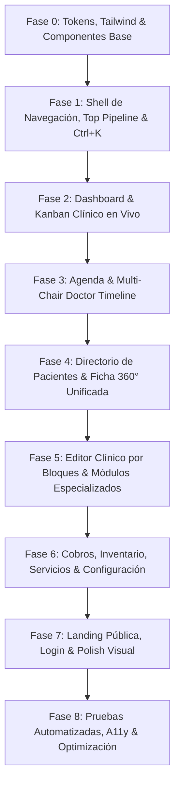

# Plan de Implementación: Rediseño Frontend "FlowGrid Medical OS"

## 1. Visión y Objetivos

Transformar el frontend de **Clínica Personal** en un sistema operativo clínico de alto rendimiento (**FlowGrid Medical OS**), inspirado en la agilidad y precisión de plataformas como Linear y Notion adaptadas al entorno de salud.

### Objetivos Clave
- **Cero clics innecesarios**: Reemplazar la navegación fragmentada por flujos continuos y atajos de teclado (`Ctrl + K`).
- **Flujo operativo en tiempo real**: Implementar un **Pipeline Kanban de pacientes** para visualizar el estado de la clínica (*Check-in / Sala de espera* $\rightarrow$ *En Consulta* $\rightarrow$ *Cobro / Farmacia*).
- **Ficha 360° unificada**: Unificar los más de 15 paneles dispersos de la historia clínica en un espacio de trabajo modular con *Timeline* continuo.
- **Agenda Multi-Chair Timeline**: Cronograma horizontal interactivo para gestionar consultorios y profesionales sin solapamientos.
- **Editor Clínico por Bloques**: Redacción ágil de notas SOAP y recetas mediante comandos rápidos (`/`).

---

## 2. Sistema de Diseño (Design Tokens & UI Kit)

| Token | Valor / Configuración | Propósito |
| :--- | :--- | :--- |
| **Fondo Base (Canvas)** | `#FFFFFF` / `#F8FAFC` (Zinc 50) | Máxima claridad visual y contraste clínico suizo. |
| **Superficies & Paneles** | `#FFFFFF` con borde `1px solid #E2E8F0` (Zinc 200) | Delimitación nítida sin sombras pesadas. |
| **Color Primario** | Azul Cobalto Médico (`#2563EB` / `#1D4ED8`) | Acciones principales, botones primarios y estados activos. |
| **Acentos de Estado** | **Ámbar** (`#F59E0B`), **Esmeralda** (`#10B981`), **Violeta** (`#8B5CF6`), **Rosa/Rojo** (`#EF4444`) | Triaje, niveles de urgencia, alertas y estados de citas. |
| **Tipografía** | `Inter` & `Inter Tight` (Google Fonts) | Legibilidad técnica, densidades de tabla y números claros. |
| **Bordes & Radios** | `rounded-lg` (8px) y `rounded-md` (6px) | Esquinas limpias, modernas y profesionales. |

---

## 3. Fases de Implementación



---

### Fase 0 — Sistema de Diseño, Tokens y Componentes Compartidos
- [x] **0.1** Actualizar `tailwind.config.js` con la paleta *FlowGrid* (Cobalt Blue `#2563EB`, Zinc Slate scale, Triage alert colors).
- [x] **0.2** Rediseñar `src/styles.css` con clases de utilidad y componentes base:
  - Botones primarios, secundarios, fantasma (*ghost*) y de acción destructiva.
  - Badges de triaje y estados clínicos con micro-indicadores pulsantes.
  - Tablas de alta densidad con cabeceras *sticky* y selección interactiva.
- [x] **0.3** Crear componentes UI compartidos:
  - `CommandPaletteComponent` (`Ctrl+K` para búsqueda global de pacientes, citas y acciones).
  - `StatusPillComponent` y `TriageBadgeComponent`.
  - `DrawerSheetComponent` (panel lateral deslizante para vistas rápidas).

---

### Fase 1 — Shell de Navegación y Top Pipeline Bar
- [x] **1.1** Rediseñar `MainLayoutComponent`:
  - Sustituir el sidebar verde pesado por un **Slim Navigation Rail (64px)** colapsable o barra superior moderna con breadcrumbs y selector de especialidad.
  - Implementar la barra superior **Pipeline Bar**: visualización en tiempo real de pacientes en espera, en consulta y pendientes de cobro.
- [x] **1.2** Integrar el buscador omnidireccional rápido en la cabecera.
- [x] **1.3** Ajustar el menú de perfil y cambio rápido de especialidad (Dermatología / Psicología).

---

### Fase 2 — Dashboard Operativo y Kanban Clínico en Vivo
- [x] **2.1** Rediseñar `DashboardComponent`:
  - Reemplazar las tarjetas estáticas actuales por un **Tablero Kanban de Flujo Clínico**:
    - **Columna 1: Check-in / Sala de espera** (con contador de minutos transcurridos y badge de triaje).
    - **Columna 2: En Atención Médica** (paciente actual en box de consulta).
    - **Columna 3: Procedimientos / Pruebas** (en ejecución).
    - **Columna 4: Facturación & Alta** (listos para cobro y salida).
- [x] **2.2** Panel superior de métricas dinámicas (Pacientes atendidos hoy, tiempo promedio de espera, ingresos del día).
- [x] **2.3** Centro de Alertas Críticas con resolución rápida en un clic.

---

### Fase 3 — Agenda Inteligente & Multi-Chair Timeline
- [x] **3.1** Rediseñar `AgendaComponent`:
  - Conmutador de 3 vistas: **Timeline Multi-Consultorio** (Gantt por médico/sala), **Calendario Semanal** y **Lista Filtrable**.
- [x] **3.2** Implementar el cronograma horizontal (*Multi-Chair Timeline*):
  - Ranuras horarias interactivas con estados visuales claros (Confirmada, En Box, Completada, Cancelada).
  - Clic en ranura libre para apertura inmediata del formulario de cita rápida.
- [x] **3.3** Panel deslizante (*Quick Drawer*) al hacer clic en una cita para ver el resumen del paciente sin abandonar la agenda.

---

### Fase 4 — Directorio de Pacientes y Ficha 360° Unificada
- [x] **4.1** Rediseñar `PatientListComponent`:
  - Grid de datos de alta velocidad con filtros por estado de alerta, fecha de última atención y búsqueda instantánea.
  - Acciones rápidas en fila (Agendar cita, abrir consulta inmediata, exportar).
- [x] **4.2** Rediseño total de `PatientDetailComponent` (Eliminación del `@switch` monolítico de 15 botones):
  - **Cabecera Persistente 360°**: Datos personales clave, alergias críticas destacadas en rojo/ámbar, diagnósticos vigentes y botones de acción rápida (*Nueva Sesión*, *Agendar Cita*).
  - **Espacio de Trabajo en Pestañas Unificadas**:
    - **Pestaña 1: Timeline Clínico**: Historial cronológico continuo de sesiones, controles y notas médicas.
    - **Pestaña 2: Expediente & Antecedentes**: Antecedentes generales, dermatológicos, quirúrgicos y medicación activa.
    - **Pestaña 3: Especialidad**:
      - *Psicología*: Evaluaciones psicométricas, gráficos de evolución y plan terapéutico.
      - *Dermatología*: Registro gráfico de lesiones, fotos clínicas, procedimientos y tratamientos.
    - **Pestaña 4: Alertas & Documentación**: Alertas activas, exámenes auxiliares y adjuntos.

---

### Fase 5 — Editor Clínico por Bloques y Módulos de Especialidad
- [x] **5.1** Rediseñar `ClinicalSessionFormComponent`:
  - Editor fluido con estructura SOAP integrada y soporte de comandos rápidos (`/`).
  - Auto-guardado en borrador local para evitar pérdida de notas médicas.
- [x] **5.2** Módulo de Psicología (`assessment-form`, `psychology-evaluation`):
  - Visualización gráfica interactiva de resultados psicométricos con barras de percentiles.
- [x] **5.3** Módulo de Dermatología (`lesions-section`, `dermatological-evaluation`):
  - Tarjetas visuales de lesiones con registro fotográfico comparativo (antes/después).

---

### Fase 6 — Cobros, Inventario, Catálogos y Servicios
- [x] **6.1** Rediseñar `BillingComponent`:
  - Registro de transacciones con buscador por paciente, comprobantes y desglose visual de ingresos por método de pago.
- [x] **6.2** Rediseñar `InventoryListComponent`:
  - Tarjetas de suministros con semáforo de stock (Crítico, Bajo, Óptimo) y ajuste de stock rápido.
- [x] **6.3** Rediseñar `ClinicalServicesListComponent` y `CatalogManagementComponent`.

---

### Fase 7 — Landing Page Pública, Login y Pulido Visual
- [x] **7.1** Rediseñar `LandingComponent`:
  - Look moderno, tipografía nítida, secciones claras de especialidades, equipo médico y reserva rápida por WhatsApp/Formulario.
- [x] **7.2** Rediseñar `LoginComponent`:
  - Pantalla de acceso minimalista suiza con soporte de credenciales seguras y microinteracciones de carga.
- [x] **7.3** Pulido de micro-animaciones (transiciones suaves en cambios de vista, feedback visual al guardar).

---

### Fase 8 — Verificación, Pruebas y Accesibilidad
- [x] **8.1** Verificación estricta de compilación y tipos:
  ```powershell
  cd frontend
  npm run build
  ```
- [x] **8.2** Pruebas unitarias de componentes y servicios:
  ```powershell
  npm test -- --watch=false
  ```
- [x] **8.3** Auditoría de accesibilidad (contrastes WCAG AA, navegación por teclado, roles ARIA en modales y menús).

---

## 4. Criterios de Éxito y Aceptación

1. **Rendimiento**: Tiempo de interacción inmediato en listados y transiciones sin parpadeos.
2. **Usabilidad Clínica**: Reducción comprobada del número de clics para iniciar una consulta y registrar una nota médica.
3. **Consistencia Visual**: Coherencia absoluta en todos los módulos bajo los tokens de diseño de *FlowGrid Medical OS*.
4. **Cero Regresiones**: Mantener el 100% de compatibilidad con los endpoints y DTOs de Spring Boot.
